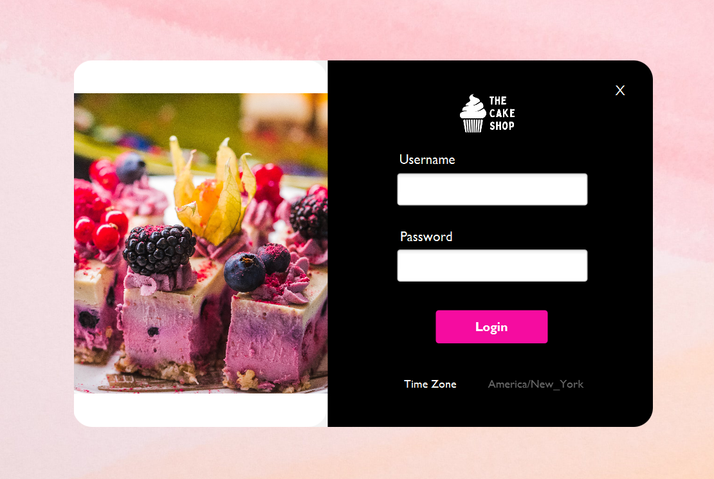

# Cake Company Appointment Booking System

It serves as an appointment booking system for a cake company, allowing employees to manage customer consultations and custom cake orders.

## Features

- Secure Login: The application provides a secure login system for authorized employees to access the appointment booking system.

- Appointment Management: Employees can add, modify, and delete appointments for customer consultations. This allows efficient scheduling and tracking of appointments.

- Customer Management: The application allows employees to manage customer information, including adding new customers and updating existing customer details.

- Reporting: The application provides reporting functionality to give employees visibility into the business's scheduling and booking processes. This helps in monitoring and analyzing the appointment data.

## Technologies Used

- Java

- IntelliJ IDEA

- MySQL

<!-- ## Getting Started

To run the Cake Company Appointment Booking System locally, follow these steps:

1. Clone the repository to your local machine.

2. Set up the MySQL database and configure the database connection details in the application.

3. Open the project in IntelliJ IDEA.

4. Build and run the application. -->
